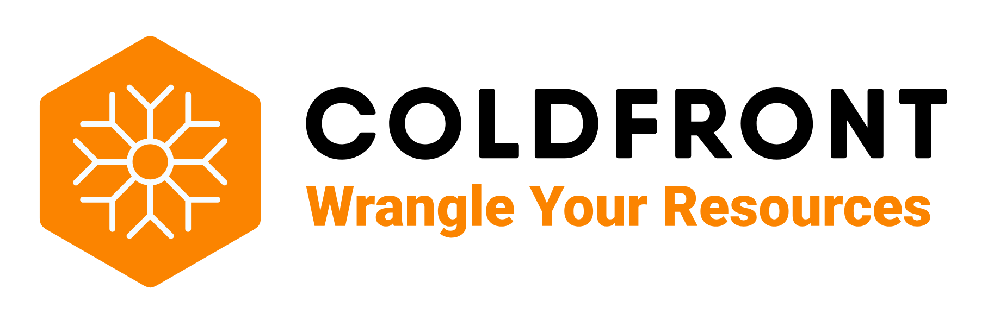

# ColdFront - Resource Allocation System

ColdFront is an open source resource and allocation management system designed to provide a central portal for administration, reporting, and measuring scientific impact
of cyberinfrastructure resources. ColdFront was created to help high performance computing (HPC) centers manage access to a diverse set of resources across large groups of users and provide a rich set of extensible meta data for comprehensive reporting. The flexiblity of ColdFront allows centers to manage and automate their policies and procedures within the framework provided or extend the functionality with [plugins](docs/pages/index.md#extensibility).  ColdFront is written in Python and released under the GPLv3 license.

## Features

- Allocation based system for managing access to resources
- Self-service portal for users to request access to resources for their research group
- Collection of Project, Grant, and Publication data from users
- Center director approval system and annual project review process
- Email notifications for expiring/renewing access to resources
- Ability to define custom attributes on resources and allocations 
- Integration with 3rd party systems for automation, access control, and other system provisioning tasks

[Learn more](https://docs.coldfront.dev/en/stable/#features)  

## Community Supported Plugins

- [OpenStack Plugin](https://github.com/nerc-project/coldfront-plugin-openstack)
- [Keycloak User Search](https://github.com/nerc-project/coldfront-plugin-keycloak)
- [Starfish Plugin](https://github.com/fasrc/sftocf)

_Submit a PR to add your plugin to the list above._

## Documentation

For more information on installing and using ColdFront see our [documentation here](https://docs.coldfront.dev/en/stable/)

## Contact Information
If you would like a live demo followed by QA, please contact us at ccr-coldfront-admin-list@listserv.buffalo.edu. You can also contact us for general inquiries and installation troubleshooting.

## ColdFront Community  

There is a large, active community around ColdFront and we invite you to join us!  

### Slack  

Use this [invitation](https://join.slack.com/t/hpctoolset/shared_invite/zt-fyhvv8j4-4KFl64etmDWRS7pATjYXPw) to join us on Slack.

### Email Lists

We have two mailing lists available for the ColdFront community.  To join either, please send an email to listserv@listserv.buffalo.edu with no subject, and the appropriate command in the body of the message - making sure to replace first_name last_name with your actual first and last name.

To join the announcement mailing list and receive news and updates use: 

subscribe CCR-COLDFRONT-ANNOUNCEMENTS-LIST@listserv.buffalo.edu first_name last_name  

To join the community forum mailing list that allows communication between community members use:  

subscribe CCR-COLDFRONT-COMMUNITY-LIST@listserv.buffalo.edu first_name last_name

### ColdFront Community Conversations  

[Monthly virtual meetings](https://coldfront.dev/community/) are held to bring the community together.  This is a place where those who have deployed ColdFront can share what they've done and customizations made.  It's a place where new or potential users can ask questions from the developers and those who are currently running ColdFront.  It's also a place where you can get to know others in the community and join working groups around topics like governance, architecture, plug-ins, and documentation.  All are welcome!

## Security  

Refer to the [security statement](SECURITY.md) for more information.  

## License

ColdFront is released under the AGPLv3 license. See REUSE.toml.
